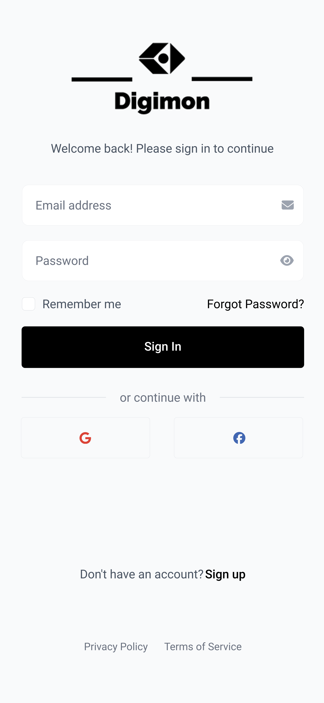
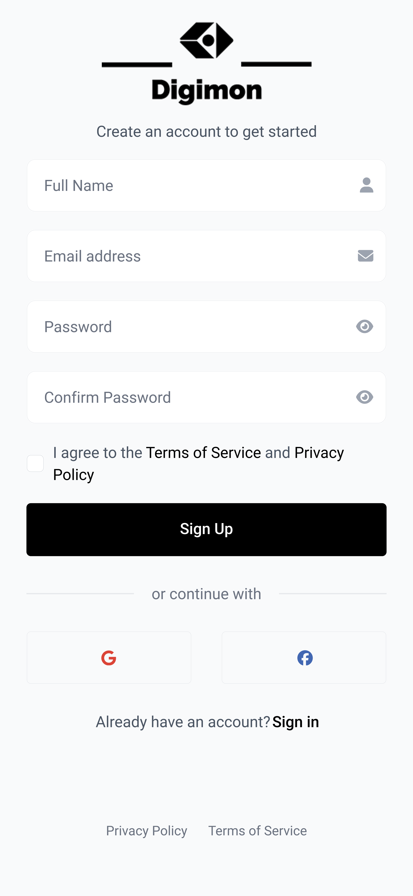
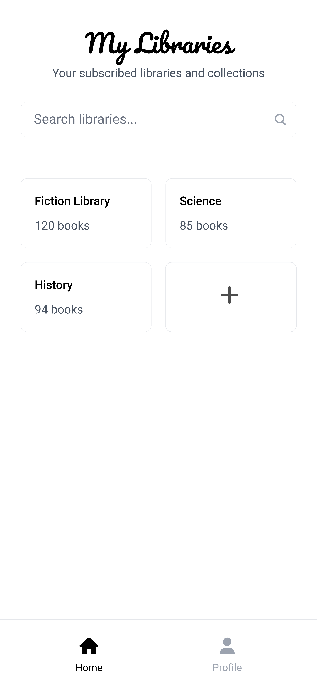
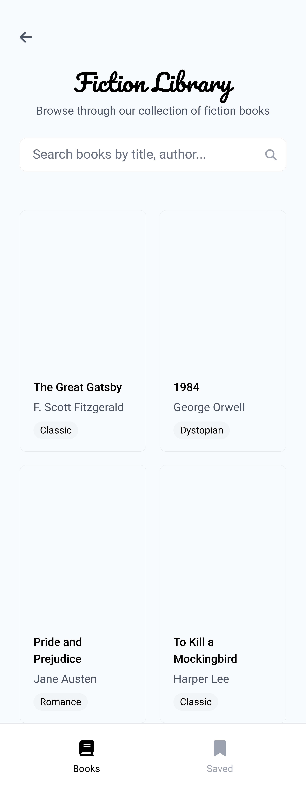
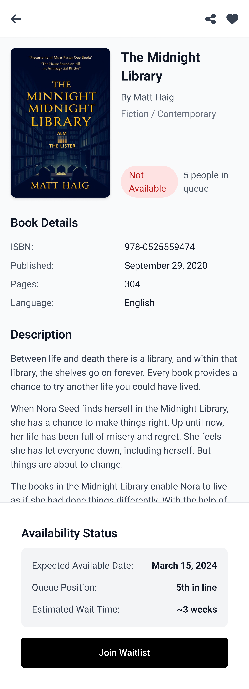

# Mobile Computing - Course Project
Expo Link: https://snack.expo.dev/@amryounes/library-system

Idea: An app that helps users book or reserve books from various libraries they are subscribed to.

## UI Designs 
### SignIn & SignUp page

### My Libraries page

### Library page

### Book Details page

---

## Fonts Used
1. Pacifico
2. Roboto

## Color Palette
Primarily black, white, and varying shades of grey.

