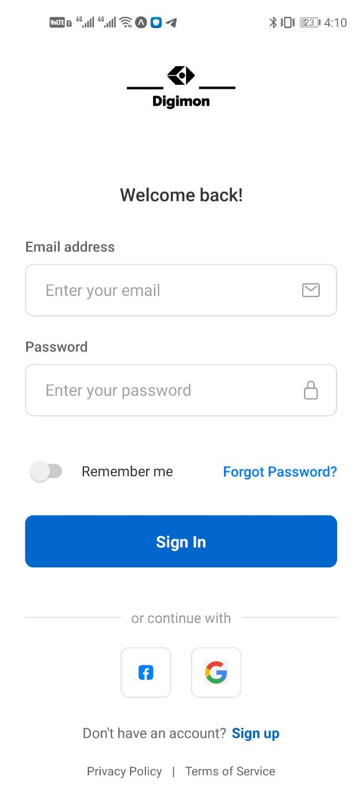
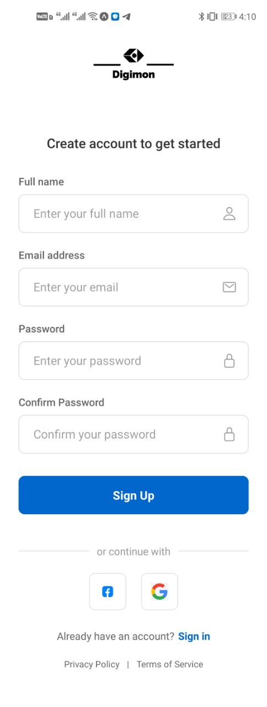
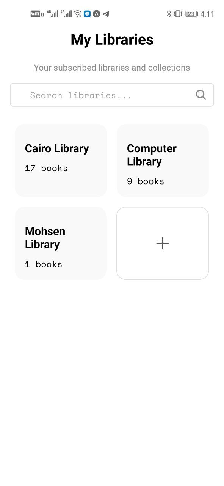
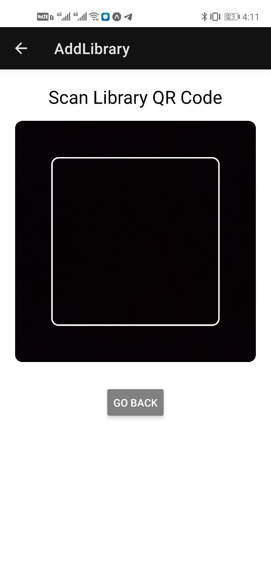
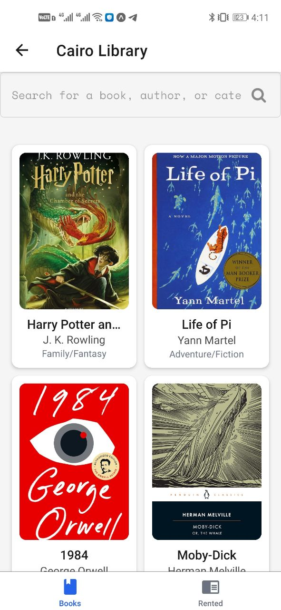
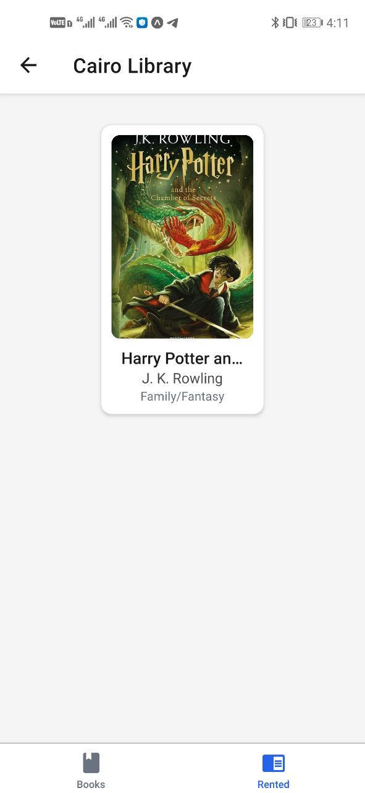
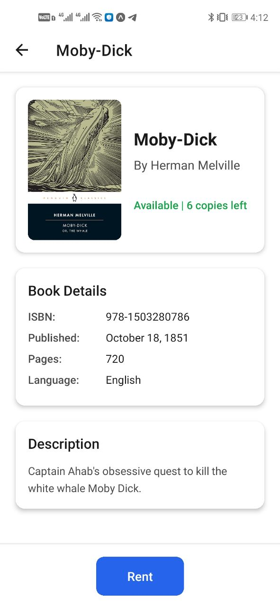
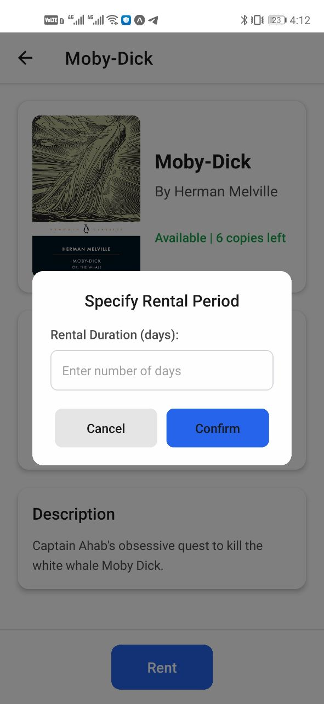
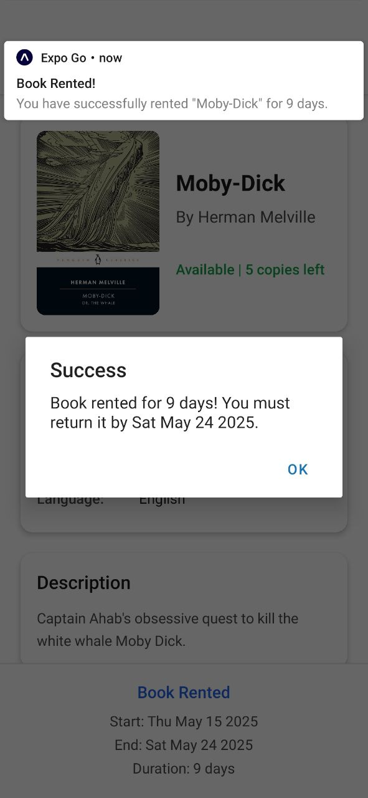
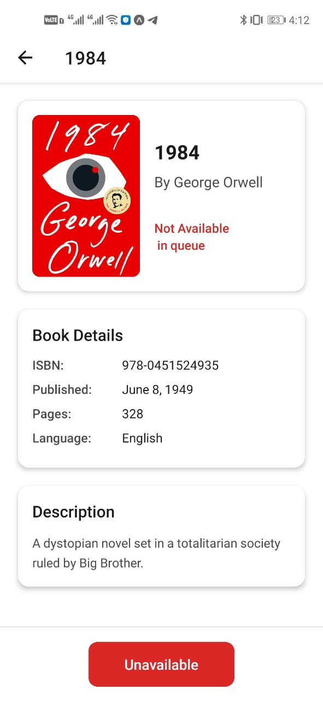

# **Demo Video**

  <a href="https://raw.githubusercontent.com/zoatel/MC-CP/main/demo.mp4">
    

      <strong>Click here to watch the demo video!</strong>
    

  </a>

# **Cover Page**

# **_Project Title_**

## Public Libraries App

---

## _Team Members_

  <!-- Team Members List -->

  <strong>Ahmad Hamdy    |    احمد حمدي جاد الله</strong> 
  <strong>Abdelrahman Mohsen    |    عبدالرحمن محسن خليل</strong> 
  <strong>Amr Hossam Mohamed    |    عمرو حسام محمد</strong> 
  <strong>Mohamed Osama    |    محمد اسامه عامر</strong> 
  <strong>Mahmoud Soliman    |    محمود سليمان محمد</strong> 
  <strong>Yassen Ashraf    |    ياسين اشرف رجب</strong>

# **_Course_**

## Mobile Computing

# **_TA Name_**

## Rania Elsayed

# **_Dr Name_**

## Ahmed Hussien

# **Introduction**

The Library Management App is a mobile and web application developed using **Expo** and **React Native**, designed to streamline library subscriptions and book rentals for users. The app integrates **Firebase Firestore** for real-time data storage and retrieval, enabling users to sign in, browse libraries, view book details, and rent books with customizable rental periods. The project aims to provide a user-friendly interface with a consistent light-themed UI across platforms, addressing navigation and styling challenges to enhance usability.

---

# **Project Features**

- **Font**:
  - **Pacifico**: A stylish, cursive font used for decorative headings or titles to enhance visual appeal.
  - **Roboto**: A versatile, sans-serif font used as the primary text font for readability and consistency across the app.
  - Custom styling applied via `StyleSheet` with properties like `fontSize` and `fontWeight`.
- **Colors**: Enforces a light theme with `#FFFFFF` (white) background, `#1A1A1A` (dark gray) text, `#2563EB` (blue) for primary actions, and `#E5E5E5` (light gray) for borders.
- **Packages/Features**:
  - **Expo (~52.0.43)**: Cross-platform development framework.
  - **Expo Router (~4.0.20)**: File-based navigation system.
  - **@react-navigation/native (7.1.8) & @react-navigation/stack (7.3.1)**: Stack navigation for screen transitions.
  - **@react-navigation/bottom-tabs (7.3.12)**: Tab navigation for `LibraryView`.
  - **Firebase (11.6.1)**: Backend database and authentication services.
  - **React (18.3.1) & React Native (0.76.9)**: Core libraries for building the UI.
  - **expo-font (~13.0.4)**: Manages font loading (e.g., Pacifico, Roboto).
  - **React Native Components**: `ScrollView`, `Modal`, `TouchableOpacity` for interactive UI.
  - **@expo/vector-icons (14.0.2)**: Provides icons for tab navigation and UI elements.
  - **expo-notifications (0.31.1)**: Handles alerts and notifications (e.g., rental success/error).
  - **react-native-gesture-handler (~2.20.2)**: Enables gesture-based interactions.
  - **react-native-safe-area-context (4.12.0)**: Ensures UI fits safely within device notches and edges.

---

# **Project GUI Screens**

- **Sign In Screen**

  

- Description: Allows users to log in with credentials.

- **Sign Up Screen**

  

- Description: Enables new user registration.

- **Home Screen**

  

- Description: Displays subscribed libraries with a search bar and an "Add Library" button.

- **Add Library Screen**

  

- Description: Interface for subscribing to new libraries.

- **Library View Screen (Books Tab)**

  

- Description: Lists books available in the selected library.

- **Library View Screen (Rented Tab)**

  

- Description: Shows books rented by the user.

- **Book Details Screen**

  

- Description: Displays book details (cover, title, author, etc.) with a "Rent" button.

- **Rental Modal (Popup)**

  

- Description: Allows users to specify rental duration (in days).

- **Success Alert**

  

- Description: Confirms successful book rental with due date.

- **Unavailable Alert**

  

- Description: Displays book unavailable if the book is out of stock in the database.

---

# **Project Pipeline**

- **Sign In → Home**: User logs in, navigates to the Home screen to view subscribed libraries.
- **Home → Add Library**: Pressing the "Add Library" button opens the Add Library screen.
- **Home → Library**: Clicking a library card navigates to the Library View screen with the selected library's ID and name.
- **Library (Books Tab) → Book Details**: Tapping a book item opens the Book Details screen with the book's ID, title, author, and category.
- **Book Details → Rental Modal**: Pressing the "Rent" button opens the Rental Modal to input rental days.
- **Rental Modal → Book Details**: Confirming a valid rental duration updates the Book Details screen with rental status and triggers a Success Alert.

---

# **Project Details**

## Frontend

- **Framework**: Built with React Native and Expo for cross-platform compatibility (web, iOS, Android).
- **Navigation**: Utilizes Expo Router for file-based routing, with a custom stack defined in `_layout.tsx` and a tab navigator in `LibraryView.js` using `@react-navigation/bottom-tabs`.
- **UI Components**: Custom components like `BookDetailUI.js` and `BookItem.js` render dynamic content (e.g., book covers, details) with `ScrollView` for scrolling and `Modal` for rental input.
- **Styling**: Managed via `StyleSheet`, enforcing a light theme with white backgrounds and shadow effects for card-like layouts.
- **Challenges**: Resolved black borders by ensuring consistent `#FFFFFF` backgrounds and fixed a navigation error by removing nested `NavigationContainer`.

## Backend

- **Database**: Firebase Firestore stores user data, library subscriptions, book details, and rental records.
- **Data Flow**: Real-time updates using `onSnapshot` for library lists and `getDoc`/`setDoc` for book details and rentals.
- **Authentication**: Firebase Authentication manages user login and signup, with `auth.currentUser?.uid` providing user IDs for data segmentation.
- **Challenges**: Ensured error handling for Firestore queries (e.g., non-existent documents) and secure data access based on user authentication.

---
